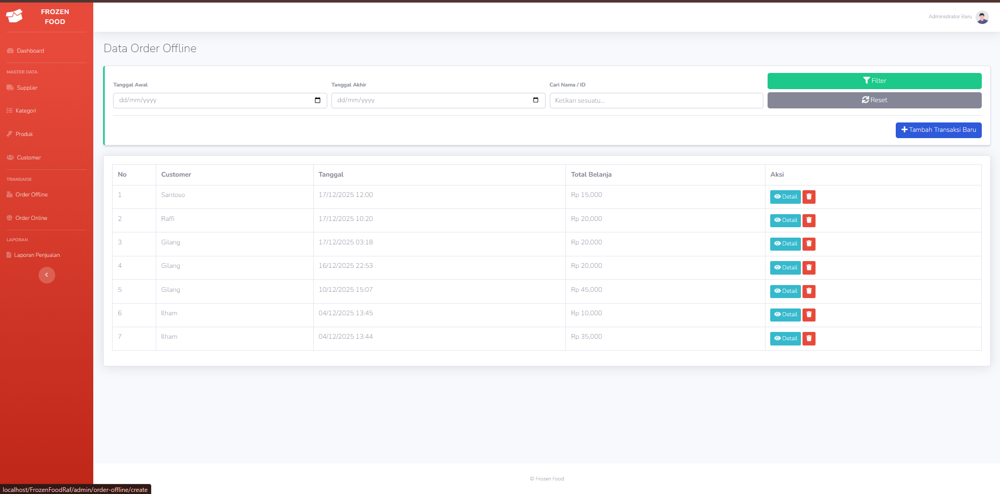
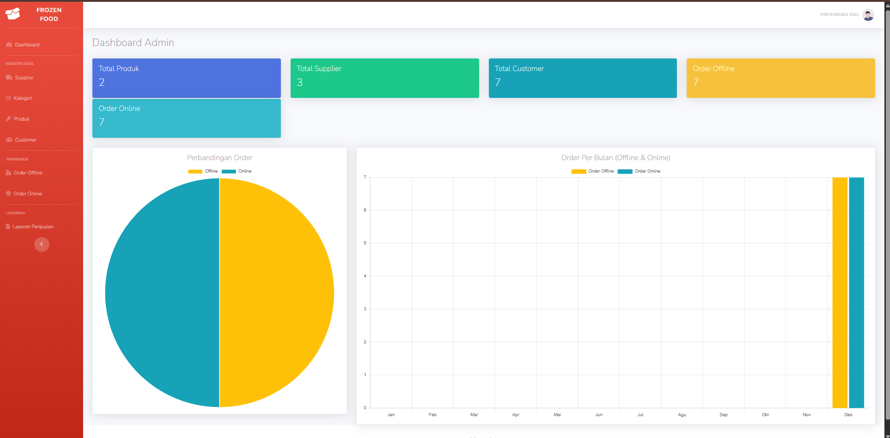
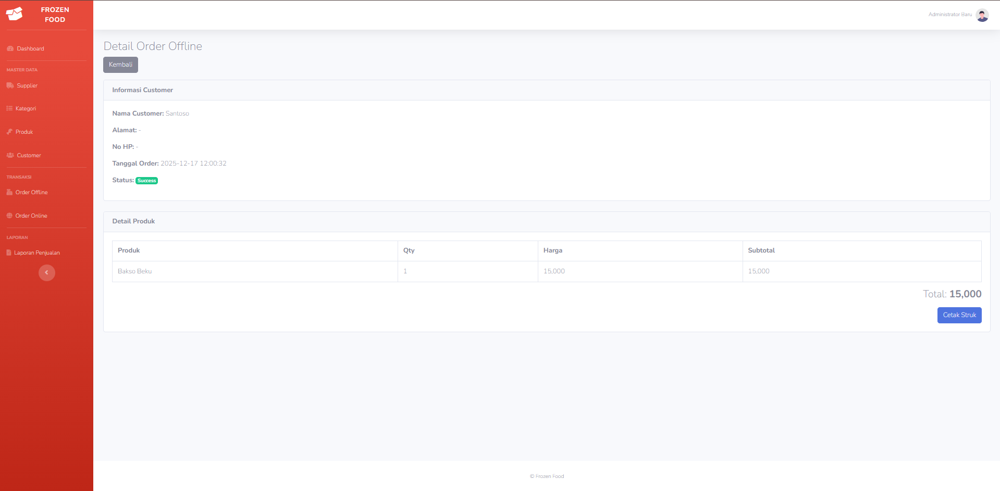

# 🛒 Raffi Frozen Food - Sistem Informasi Penjualan


**Raffi Frozen Food** adalah aplikasi e-commerce berbasis web untuk mengelola penjualan produk makanan beku. Sistem ini dirancang untuk menangani dua jenis transaksi sekaligus: **Order Online** (oleh customer terdaftar) dan **Order Offline** (Walk-in customer/Kasir).

Project ini dibuat sebagai tugas mata kuliah Web Design / Pemrograman Web.

---

## 📸 Screenshots
| Dashboard Admin | Transaksi Offline | Detail Order |
| :---: | :---: | :---: |
|  |  |  |

---

## 🔥 Fitur Utama

### 1. Panel Admin (Backend)
* **Dashboard:** Ringkasan penjualan dan statistik singkat.
* **Manajemen Produk:**
    * CRUD Produk (Tambah, Edit, Hapus dengan validasi relasi).
    * Manajemen Kategori & Supplier.
    * Upload Gambar Produk.
* **Transaksi Offline (Kasir):**
    * Input manual nama customer (tanpa login).
    * Pilih produk & qty (otomatis cek stok).
    * Cetak Struk Belanja.
* **Manajemen Order Online:**
    * Verifikasi Pembayaran (Cek Bukti Transfer).
    * Fitur Tolak Pesanan (Stok kembali otomatis).
    * Zoom Bukti Bayar.
* **Laporan:** Rekap data penjualan.

### 2. Sisi User (Frontend)
* Registrasi & Login Member.
* Katalog Produk (Pencarian & Filter Kategori).
* Keranjang Belanja (Cart).
* Checkout & Upload Bukti Pembayaran.
* Riwayat Pesanan & Status Order.

---

## 🛠️ Teknologi yang Digunakan

* **Bahasa Pemrograman:** PHP 7.4+
* **Framework:** CodeIgniter 3
* **Database:** MySQL
* **Frontend Library:**
    * Bootstrap 4 (SB Admin 2 Theme)
    * SweetAlert2 (Notifikasi Modern)
    * jQuery & AJAX
* **Tools:** Visual Studio Code, XAMPP/Laragon.

---

## 💻 Cara Instalasi (Localhost)

Ikuti langkah-langkah ini untuk menjalankan project di komputer Anda:

1.  **Clone / Download Repository**
    ```bash
    git clone [https://github.com/username-anda/raffi-frozen-food.git](https://github.com/username-anda/raffi-frozen-food.git)
    ```
    *(Atau ekstrak file ZIP ke folder `htdocs` atau `www`)*.

2.  **Import Database**
    * Buka **phpMyAdmin** (http://localhost/phpmyadmin).
    * Buat database baru dengan nama `frozenfoodraf`.
    * Import file `frozenfoodraf.sql` yang ada di folder project.

3.  **Konfigurasi Base URL & Database**
    * Buka `application/config/config.php`:
        ```php
        $config['base_url'] = 'http://localhost/raffi-frozen-food/';
        ```
    * Buka `application/config/database.php`:
        ```php
        'hostname' => 'localhost',
        'username' => 'root',
        'password' => '', // Sesuaikan password db anda
        'database' => 'frozenfoodraf',
        ```

4.  **Jalankan Project**
    Buka browser dan akses:
    `http://localhost/raffi-frozen-food/`

---

## 👤 Akun Login Default

**Admin:**
* Username: `admin`
* Password: `password` *(atau sesuaikan dengan data di tabel user)*

**User:**
* Silakan daftar akun baru melalui halaman Register.

---

## 👨‍💻 Author

**Muhammad Raffi Ar-rosyid**
* **NIM:** 1124160189
* **Jurusan:** Teknik Informatika - Software Engineering
* **Kampus:** Global Institute

---

**Catatan:**
Project ini masih dalam tahap pengembangan. Jika menemukan bug, silakan buat *issue* atau hubungi pengembang.
